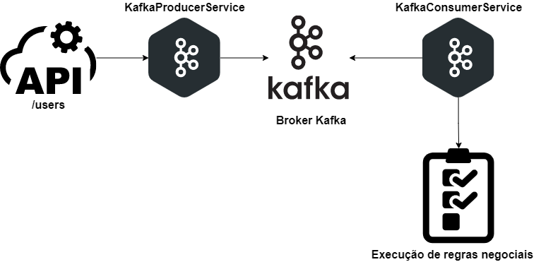

<div align="center">


</div>

<div align="center">

# POC - NodeJS, NestJS, Apache Kafka.
Trata-se de uma aplicação de prova de conceito para desenvolver um consumer e um producer utilizando arquitetura: NestJS, NodeJS, KafkaJS e Apache Kafka.


</div>

<div align="center">

## Documentação OpenAPI
Clique no ícone para abrir a documentação da API.

[](http://localhost:3000/docs/)

</div>


<div align="center">

## Arquitetura


</div>

## Fundamentos teóricos

> NestJS: O NestJS é um framework back-end que auxilia o desenvolvimento de aplicações eficientes. escaláveis e confiáveis em cima do Node.js. O NestJS utiliza como padrão TypeScript e possui uma sintaxe parecida com Angular.

> KafkaJS: O KafkaJS é um cliente Apache Kafka moderno para Node.js. É compatível com Kafka 0.10+ e oferece suporte nativo para recursos 0.11.

> Swagger: Swagger é uma linguagem de descrição de interface para descrever APIs RESTful expressas usando JSON. O Swagger é usado junto com um conjunto de ferramentas de software de código aberto para projetar, construir, documentar e usar serviços da Web RESTful. 

> Apache Kafka: Apache Kafka é uma plataforma open-source de processamento de streams desenvolvida pela Apache Software Foundation, escrita em Scala e Java. O projeto tem como objetivo fornecer uma plataforma unificada, de alta capacidade e baixa latência para tratamento de dados em tempo real.

> NodeJS: Node.js é um software de código aberto, multiplataforma, baseado no interpretador V8 do Google e que permite a execução de códigos JavaScript fora de um navegador web.

## Instalação de ambiente

```bash
$ nest new poc-nestjs-kafkajs

$ npm i --save @nestjs/microservices kafkajs

$ npm install --save @nestjs/swagger swagger-ui-express
```

## Executando a aplicação

- Obs, após subir o docker compose, entrar no control center: http://localhost:9021 -> topics -> add a topic e criar com o nome: users

```bash
# docker
$ docker-compose -f docker-compose.yml up

# development
$ npm run start

# watch mode
$ npm run start:dev

# production mode
$ npm run start:prod
```

## Utilização
- Efetuar uma requisição REST com verbo POST na seguinte URL: http://localhost:3000/users/publish
- Payload
    ```json 
         {
            "nome": "Anderson Severino Sebastião Moura",
            "email": "andersonsever@creativeinteriores.com.br",
            "phone": "55987640532",
            "password": "12345"
         }
    ```
  
